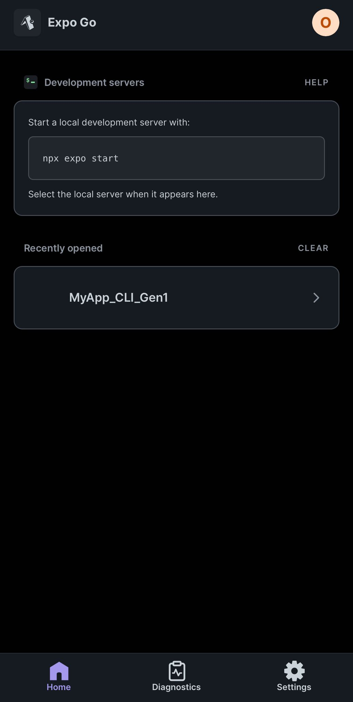
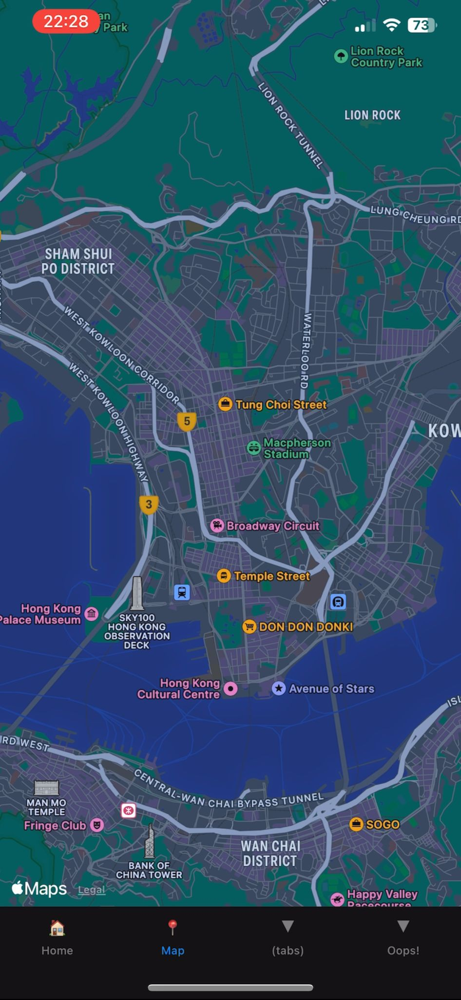
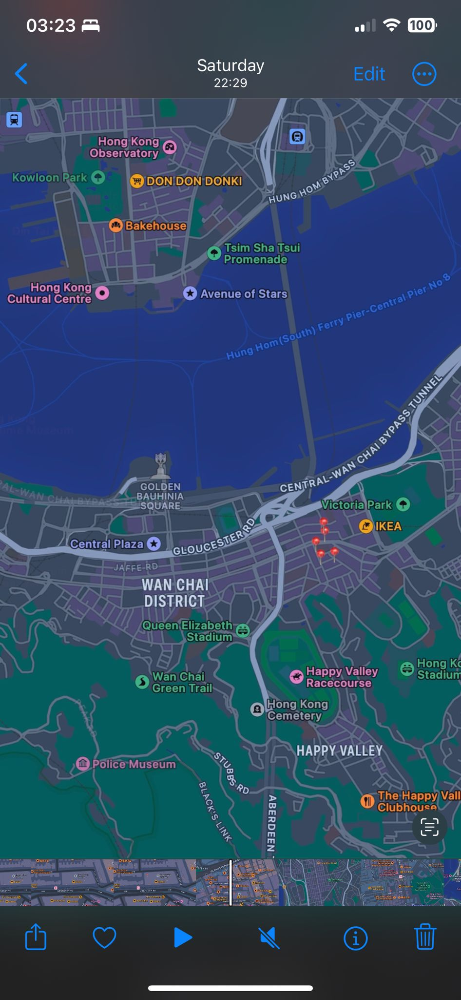
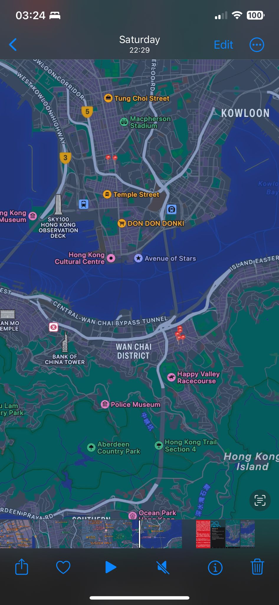
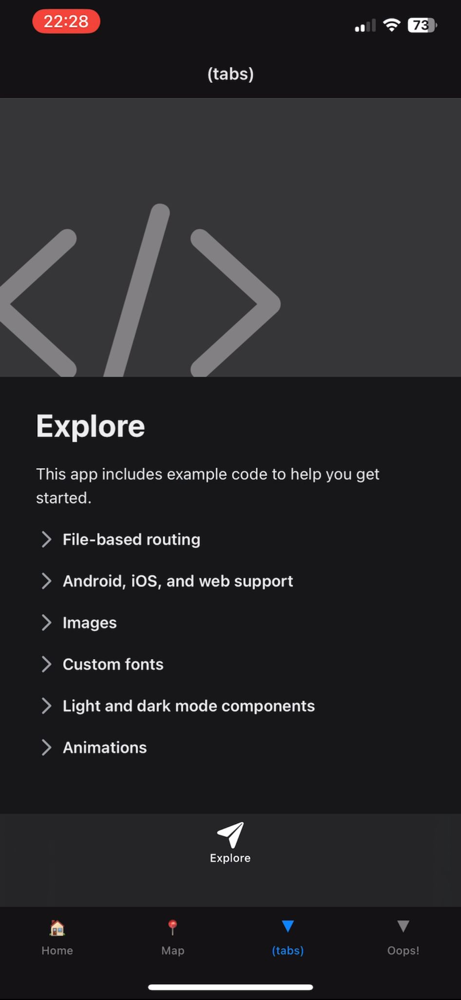

# Welcome to your Expo app 👋

This is an [Expo](https://expo.dev) project created with [`create-expo-app`](https://www.npmjs.com/package/create-expo-app).

## Get started

1. Install dependencies

   ```bash
   npm install
   ```

2. Start the app

   ```bash
   npx expo start
   ```

In the output, you'll find options to open the app in a

- [development build](https://docs.expo.dev/develop/development-builds/introduction/)
- [Android emulator](https://docs.expo.dev/workflow/android-studio-emulator/)
- [iOS simulator](https://docs.expo.dev/workflow/ios-simulator/)
- [Expo Go](https://expo.dev/go), a limited sandbox for trying out app development with Expo

You can start developing by editing the files inside the **app** directory. This project uses [file-based routing](https://docs.expo.dev/router/introduction).

## Get a fresh project

When you're ready, run:

```bash
npm run reset-project
```

This command will move the starter code to the **app-example** directory and create a blank **app** directory where you can start developing.

## Learn more

To learn more about developing your project with Expo, look at the following resources:

- [Expo documentation](https://docs.expo.dev/): Learn fundamentals, or go into advanced topics with our [guides](https://docs.expo.dev/guides).
- [Learn Expo tutorial](https://docs.expo.dev/tutorial/introduction/): Follow a step-by-step tutorial where you'll create a project that runs on Android, iOS, and the web.

## Join the community

Join our community of developers creating universal apps.

- [Expo on GitHub](https://github.com/expo/expo): View our open source platform and contribute.
- [Discord community](https://chat.expo.dev): Chat with Expo users and ask questions.


Certainly! Below is a detailed documentation of your project journey, including the setup, progress, setbacks, and accomplishments, formatted for inclusion in your `README.md` file on GitHub. You can copy this text into your `README.md` and adjust formatting as needed for Markdown.

---

# Project Documentation: MyApp_CLI_Gen1

## Overview

This project, named **MyApp_CLI_Gen1**, was initiated as part of an internship to develop a mobile application using Expo, React Native, AWS Amplify, and Redux for state management. The primary goal was to create an app with a map interface where users can interact with markers, leveraging AWS services for backend functionality.

## Project Setup

### Day 1-2

#### 1. **Project Initialization with Expo**

- **Command Used**: `npx create-expo-app@latest MyApp_CLI_Gen1 --template tabs@53`
- **Outcome**: Successfully created an Expo project with a basic tab-based navigation structure.

#### 2. **AWS Amplify CLI Setup**

- **Installation**: Installed AWS Amplify CLI globally using `npm install -g @aws-amplify/cli`.
- **Configuration**: Ran `amplify init` to initialize Amplify in the project:
  - Configured with default settings for a React Native project.
  - Set up with AWS profile for authentication.

- **Adding AWS Services**:
  - **Authentication**: Added AWS Cognito for user authentication.
  - **Storage**: Configured a DynamoDB table (`markersTable`) for storing map markers.
  - **API**: Created a REST API (`markerAPI`) with a Lambda function (`manageMarkers`) for CRUD operations on markers.

#### 3. **React Native Maps Integration**

- **Installation**: Added `react-native-maps` via `npm install react-native-maps`.
- **Implementation**: Integrated a basic map view in `map.tsx` displaying Hong Kong.

#### 4. **State Management with Redux**

- **Setup**: Installed Redux and Redux Toolkit:
  - `npm install @reduxjs/toolkit react-redux`
- **Store Configuration**: Created a Redux store in `store.ts` and a slice for managing map markers in `mapSlice.tsx`.

## Progress and Development

### Day 2-4 
#### 1. **Testing the App**

- **Initial Testing**: Ran the app using `npx expo start --clear` to test basic functionality.
- **Encountered Issues**: Faced TypeScript errors related to module imports.

#### 2. **Implementing CRUD Operations**

- **Fetch Markers**: Implemented `fetchMarkers` in `mapSlice.tsx` using `createAsyncThunk` to retrieve markers from the backend.
- **Add Marker**: Added functionality in `map.tsx` to add markers via map press, which sends a POST request to the API and updates the Redux store.
- **Remove Marker**: Implemented marker removal via a callout press, which sends a DELETE request and updates the store.

#### 3. **Setbacks**

- **TypeScript Errors**: Multiple errors related to module resolution and type declarations:
  - "Module 'react-native' has no exported member 'Platform'."
  - "Module 'react-native' has no exported member 'StyleSheet'."
  - "Cannot find module '@/components/ThemedText' or its corresponding type declarations."
  - Similar issues for other custom components and hooks.
- **Amplify Configuration**: Initial confusion due to moving files from a subdirectory (`MyAmplifyCLI`) to the root, which might have caused path issues.

#### 4. **Solutions Attempted**

- **Uninstall and Reinstall**: Uninstalled and reinstalled `aws-amplify`.
- **TypeScript Configuration**: Updated `tsconfig.json` to fix module resolution issues.
- **Path Aliases**: Configured path aliases in `tsconfig.json` for easier module imports.
- **File Path Verification**: Checked existence and paths of custom components.
- **Dependency Check**: Verified all necessary dependencies were installed.

## Decision to Start Over

After numerous attempts to resolve the TypeScript import issues and ensuring the Amplify backend was correctly set up, it was decided to start the project from scratch due to:

- **Persistent Errors**: Despite multiple troubleshooting steps, TypeScript errors persisted, hindering development progress.
- **Project Complexity**: The project structure had become complex due to initial file reorganization, making it harder to trace and fix issues.

### Before Starting Over

- **Backup**: A complete backup of the project was made to preserve work done.
- **Documentation**: This documentation was created to capture the journey, including setbacks and solutions.

## Accomplishments

- **Learned AWS Amplify**: Gained experience in setting up and configuring AWS services via Amplify CLI.
- **Expo and React Native**: Successfully set up an Expo project with React Native components.
- **Redux Integration**: Implemented state management with Redux Toolkit, broadening knowledge in state management in React applications.
- **Map Interaction**: Developed basic map functionality with `react-native-maps`, including marker interactions.

## Conclusion

This project served as a valuable learning experience in integrating various technologies for mobile app development. Although starting over, the insights gained from this attempt will be invaluable for the next iteration, ensuring a smoother development process with fewer setbacks.

---

# Condensed version of progress recap:

**Project Setup:** The project is an Expo app created with create-expo-app, using file-based routing.

**AWS Amplify Integration:** Integrated AWS Amplify into your project with:
- Authentication setup via AWS Cognito.
- A DynamoDB table (markersTable) for storing map markers.
- A Lambda function (manageMarkers) for backend logic.
- A REST API (markerAPI) to interact with your backend.

**Frontend Development:**
- Set up navigation with Expo Router, having tabs for 'Home' and 'Map'.
Implemented react-native-maps for map display, initially centered on Hong Kong.
- Configured Redux with Redux Toolkit for state management, particularly for map markers.

**Recent Actions:**
- Uploaded your project to GitHub, creating a repository for version control.
- Checked the version of aws-amplify installed, which is 6.15.3.
- Created a new branch to safely test changes like reinstalling 'aws-amplify'.

**Current Issues:**
Import Error: You're encountering an error with importing API from aws-amplify. The error suggests that API is not recognized in the current version of aws-amplify.

**Proceeding with Development:**
- Testing the App: After resolving the import issue, run npx expo start --clear to ensure the app runs without errors. Test navigation, map interaction, and marker functionality.

**Implementing CRUD Operations: Focus on:**

- Fetch Markers: Ensure fetchMarkers in mapSlice.tsx works to populate the map with existing markers from DynamoDB.

- Add Marker: Confirm that adding a marker updates both the Redux store and the backend via your API.

- Remove Marker: Ensure removing a marker works similarly.

**Styling and UI Enhancements:** Customize the UI for a better user experience, possibly adding icons, improving map controls, or enhancing marker display.

**User Authentication:** Implement and test user authentication with AWS Cognito, ensuring that users must log in to interact with the map features.


```
BACKEND
Set-up Amplify CLI backend:
- Container DONE
- Authentication Email/Password flow (Default / OAuth credentials might cost me $$$) DONE
- Add API: markerAPI /markers/{id}
- AWS Lambda function name: manageMarkers
- Choose the function template: CRUD function for DynamoDB (Intergration with API)
Why: This template will provide a starting point for creating, reading, updating and deleting marker data in DynamoDB

DynamoDB:
- DynamoDB: Create a new DynamoDB table (name: markersTable)
- id (type: string)
- lat (latitude - type: number)
- lng (longnitude - type: number)
Why: Useful for representing geopgraphical coordinates (that can be stored as decimal numbers which fits well with the number data type in DynamoDB)

 Current Environment: dev
    
┌──────────┬──────────────────────┬───────────┬───────────────────┐
│ Category │ Resource name        │ Operation │ Provider plugin   │
├──────────┼──────────────────────┼───────────┼───────────────────┤
│ Storage  │ markersTable         │ Create    │ awscloudformation │
├──────────┼──────────────────────┼───────────┼───────────────────┤
│ Function │ manageMarkers        │ Create    │ awscloudformation │
├──────────┼──────────────────────┼───────────┼───────────────────┤
│ Api      │ markerAPI            │ Create    │ awscloudformation │
├──────────┼──────────────────────┼───────────┼───────────────────┤
│ Auth     │ myamplifycli0ba31264 │ No Change │ awscloudformation │
└──────────┴──────────────────────┴───────────┴───────────────────┘
✔ Are you sure you want to continue? (Y/n) · yes
```

# Screen Shot references









